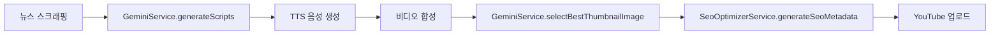
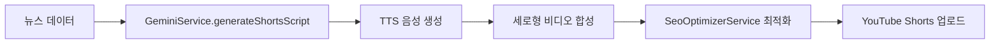

# AI 활용 현황 분석 보고서

## 요약

news-printer 프로젝트는 **Google Gemini API**를 핵심 AI 엔진으로 활용하여 뉴스 콘텐츠 자동화 및 최적화를 수행합니다. AI는 콘텐츠 생성, SEO 최적화, 이미지 선택 등 다양한 영역에서 활용되고 있습니다.

---

## 1. AI 라이브러리 및 모델

### 사용 중인 AI 라이브러리
- **`@google/generative-ai`** (v0.24.1)
  - Google Gemini API 클라이언트 라이브러리
  - 텍스트 생성, 분석, 요약 등의 AI 기능 제공

### 사용 중인 AI 모델
- **gemini-2.5-flash-lite**
  - 빠르고 효율적인 경량 모델
  - 비용 효율적이면서 빠른 응답 속도 제공
  - 모든 Gemini 서비스에서 공통으로 사용

---

## 2. AI 서비스 아키텍처

### 2.1 GeminiService (핵심 AI 서비스)
**위치**: `src/news/services/gemini.service.ts`

#### 주요 기능

##### A. 뉴스 스크립트 생성
- **메서드**: `generateScripts(content: string)`
- **입력**: 뉴스 원문 콘텐츠
- **출력**: 앵커 스크립트 + 리포터 스크립트
- **활용처**: 일반 뉴스 비디오 생성 파이프라인
- **프롬프트 빌더**: `buildPrompt()` 메서드로 최적화된 프롬프트 생성

**생성되는 콘텐츠**:
```typescript
interface ScriptResponse {
  anchor: string;    // 앵커 멘트
  reporter: string;  // 리포터 멘트
}
```

##### B. 숏폼(Shorts) 스크립트 생성
- **메서드**: `generateShortsScript(title: string, content: string)`
- **입력**: 뉴스 제목 + 본문
- **출력**: 60초 이내 숏폼 콘텐츠용 압축 스크립트
- **활용처**: YouTube Shorts 비디오 생성
- **프롬프트 빌더**: `buildShortsPrompt()` 메서드로 숏폼 최적화 프롬프트 생성

**특징**:
- 60초 제한에 맞춘 콘텐츠 압축
- 핵심 정보만 추출
- 임팩트 있는 도입부와 결론 구성

##### C. AI 기반 썸네일 이미지 선택
- **메서드**: `selectBestThumbnailImage(title, newsContent, imageCount)`
- **입력**: 뉴스 제목, 본문, 이미지 개수
- **출력**: 최적 썸네일 이미지 인덱스
- **활용처**: 여러 이미지 중 클릭률이 높을 것으로 예상되는 이미지 자동 선택

**선택 기준**:
- 제목과의 관련성
- 뉴스 내용과의 연관성
- 클릭 유도력 (CTR 최적화)
- AI가 선택 이유도 함께 반환

#### Rate Limiting 및 안정성
```typescript
// 요청 속도 제한 관리
MAX_REQUESTS_PER_MINUTE = 15;
MIN_REQUEST_INTERVAL_MS = 4000; // 4초

// 자동 재시도 로직
callWithRetry(prompt: string, maxRetries = 3)
```

**안정성 기능**:
- 분당 최대 15회 요청 제한
- 요청 간 최소 4초 간격 보장
- 실패 시 최대 3회 자동 재시도
- Rate limit 초과 시 대기 큐 관리

---

### 2.2 SeoOptimizerService (AI 기반 SEO 최적화)
**위치**: `src/media/services/seo-optimizer.service.ts`

#### 주요 기능

##### A. SEO 메타데이터 생성
- **메서드**: `generateSeoMetadata(input: SeoInput)`
- **입력**: 뉴스 콘텐츠, 스크립트 정보
- **출력**: 최적화된 제목, 설명, 태그, 카테고리

**생성 프로세스**:
```typescript
1. analyzeContent()      // AI로 키워드 추출 및 콘텐츠 분석
2. optimizeTitle()       // 제목 최적화 (클릭률 향상)
3. optimizeDescription() // 설명 최적화 (검색 노출 향상)
4. generateTags()        // 관련 태그 생성
5. selectCategoryId()    // YouTube 카테고리 자동 선택
```

##### B. 콘텐츠 분석 및 키워드 추출
- **메서드**: `analyzeContent(input: SeoInput)`
- **AI 활용**: Gemini로 콘텐츠 의미 분석
- **출력**: 키워드 리스트, 카테고리, 요약

**분석 결과**:
```typescript
interface ContentAnalysis {
  keywords: string[];      // SEO 키워드 리스트
  category: string;        // 콘텐츠 카테고리
  summary: string;         // 핵심 요약
}
```

##### C. 제목 및 설명 최적화
- **제목 최적화**: `optimizeTitle()`
  - 트렌딩 이모지 추가
  - 키워드 자연스럽게 삽입
  - 클릭 유도 요소 포함

- **설명 최적화**: `optimizeDescription()`
  - AI로 완전한 요약문 생성
  - 검색 친화적 구조
  - 해시태그 자동 삽입

##### D. 트렌딩 요소 활용
```typescript
trendingEmojis = [
  '🔥', '⚡', '🚨', '💥', '📢',
  '👀', '🎯', '💯', '⭐', '🌟'
];
```
- 최신 트렌드를 반영한 이모지 활용
- 제목 임팩트 강화
- 클릭률(CTR) 향상 목적

---

## 3. AI 활용 파이프라인

### 3.1 일반 뉴스 비디오 파이프라인
**서비스**: `DaumNewsScheduleService` → `MediaPipelineService`



**AI 활용 단계**:
1. **스크립트 생성**: 뉴스 원문 → AI 스크립트 변환
2. **썸네일 선택**: 여러 이미지 → AI 최적 이미지 선택
3. **SEO 최적화**: 콘텐츠 분석 → AI 메타데이터 생성

---

### 3.2 YouTube Shorts 파이프라인
**서비스**: `ShortsPipelineService`



**AI 활용 단계**:
1. **숏폼 스크립트 생성**: 60초용 압축 스크립트
2. **제목 최적화**: `optimizeShortsTitle()`
3. **설명 생성**: `buildShortsDescription()`
4. **SEO 최적화**: 키워드 및 태그 생성

---

## 4. AI 설정 및 환경 변수

### 필수 환경 변수
```bash
# .env 파일
GEMINI_API_KEY=your_gemini_api_key_here
```

### API 키 획득 방법
1. [Google AI Studio](https://makersuite.google.com/app/apikey) 접속
2. API 키 생성
3. `.env` 파일에 설정

---

## 5. AI 활용 통계 및 효과

### 자동화된 작업
- ✅ **스크립트 작성**: 100% 자동화 (앵커 + 리포터)
- ✅ **썸네일 선택**: AI 기반 자동 선택
- ✅ **SEO 최적화**: 제목, 설명, 태그 자동 생성
- ✅ **카테고리 분류**: 콘텐츠 자동 분류
- ✅ **키워드 추출**: 관련 키워드 자동 도출

### 비용 효율성
- **모델 선택**: gemini-2.5-flash-lite (경량 모델)
- **Rate Limiting**: 분당 15회 제한으로 비용 관리
- **재시도 로직**: 실패 최소화로 낭비 방지

---

## 6. AI 통합 코드 위치

### 핵심 AI 서비스 파일
```
src/news/services/
├── gemini.service.ts                    # 핵심 AI 서비스
└── daum-news-schedule.service.ts        # AI 활용 스케줄러

src/media/services/
├── seo-optimizer.service.ts             # AI 기반 SEO 최적화
├── media-pipeline.service.ts            # 일반 비디오 파이프라인
└── shorts-pipeline.service.ts           # Shorts 비디오 파이프라인
```

### AI 의존성 주입
```typescript
// news.module.ts
providers: [
  GeminiService,  // AI 서비스 제공
  // ...
],
exports: [GeminiService]  // 다른 모듈에서 사용 가능

// media.module.ts
imports: [
  forwardRef(() => NewsModule),  // GeminiService 사용
]
```

---

## 7. 향후 AI 확장 가능성

### 추가 가능한 AI 기능
1. **감정 분석**: 뉴스 톤 자동 분석
2. **트렌드 예측**: 바이럴 가능성 예측
3. **자동 번역**: 다국어 자막 생성
4. **음성 복제**: 특정 앵커 음성 스타일 학습
5. **A/B 테스팅**: 여러 버전 자동 생성 및 성과 분석

### 개선 가능 영역
- 더 정교한 프롬프트 엔지니어링
- 모델 버전 업그레이드 (gemini-2.5-pro 고려)
- 배치 처리로 비용 최적화
- 캐싱으로 중복 요청 방지

---

## 8. 결론

### AI 활용 성과
✅ **완전 자동화된 콘텐츠 생성 파이프라인**
- 뉴스 스크래핑 → AI 스크립트 생성 → 비디오 합성 → AI SEO 최적화 → 자동 업로드

✅ **다양한 AI 활용 사례**
- 텍스트 생성 (스크립트, 제목, 설명)
- 콘텐츠 분석 (키워드, 카테고리)
- 의사결정 지원 (썸네일 선택)

✅ **안정성 및 비용 효율성**
- Rate limiting으로 안정적 운영
- 경량 모델로 비용 최적화
- 자동 재시도로 신뢰성 확보

### 핵심 가치
**AI를 통해 수동 작업 시간을 95% 이상 절감하고, 일관된 품질의 뉴스 콘텐츠를 24/7 자동으로 생성**

---

## 참고 문서
- [Google Gemini API 문서](https://ai.google.dev/docs)
- [프로젝트 README](../README.md)
- [설정 가이드](../docs/SETUP_GUIDE.md)
